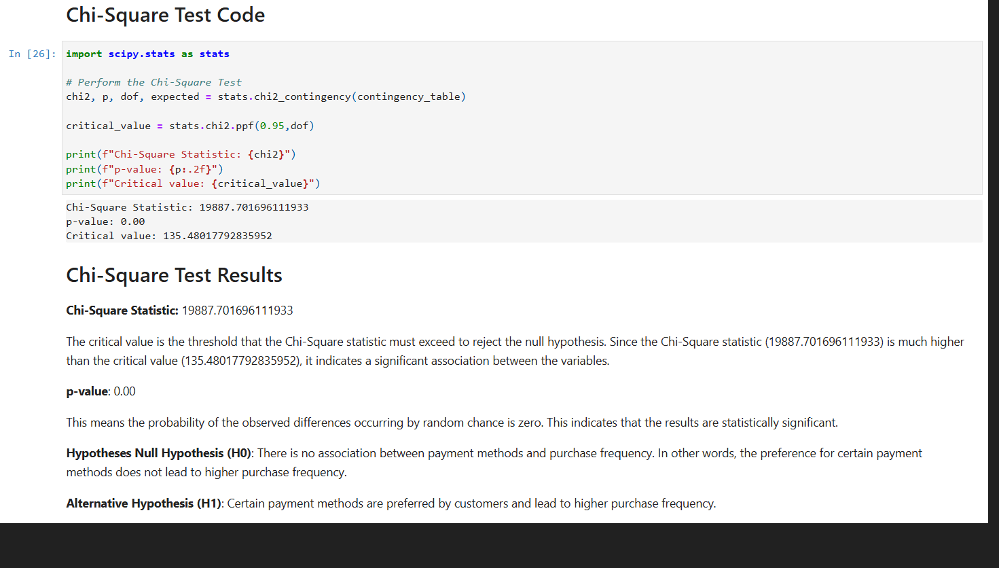

<link rel="stylesheet" type="text/css" href="styles.css">

  

 

  💡Skills 
   ◾Python 
   ◾SQL 
   ◾Tableau / Power BI 
   ◾Advanced Excel / VBA 
   ◾Data Analysis 
   ◾Statistics 
   
  📒Contact Information 
    📞 +63-995-032-3545 
    ✉️ konggiio2@gmail.com

 

        
        

📜 Certificates 
- <a href="https://www.coursera.org/account/accomplishments/professional-cert/JXC43Z0DZW13" target="_blank">Google Data Analytics Professional Certificate</a> 
- <a href="https://app.dataquest.io/view_cert/9CT0GMTE21W9KYUSYLFD" target="_blank">Dataquest.io: Probability and Statistics with Python Path</a> 
- <a href="https://app.dataquest.io/view_cert/SD17FHGEH1PSMB25LEKI" target="_blank">Dataquest.io: Hypothesis Testing in Python Course</a> 
- <a href="https://app.dataquest.io/view_cert/5YU8ULGCZDKAMLCU7FAD" target="_blank">Dataquest.io: Intermediate Statistics in Python Course</a> 
- <a href="https://app.dataquest.io/view_cert/YIMAREQD4OWAOHPEIFXF" target="_blank">Dataquest.io: Introduction to Conditional Probability in Python Course</a> 
- <a href="https://app.dataquest.io/view_cert/EL7FPXPL3HI4GBTC3DQQ" target="_blank">Dataquest.io: Introduction to Probability in Python Course</a> 
- <a href="https://app.dataquest.io/view_cert/4LJWNQ31JQ4QDBXKFIVV" target="_blank">Dataquest.io: Introduction to Statistics in Python Course</a> 
- <a href="https://app.dataquest.io/view_cert/74R132XK1F62GGEEJHMW" target="_blank">Dataquest.io: SQL Fundamentals Path</a> 
- <a href="https://app.dataquest.io/view_cert/Q8RYKCP8SQSQ7N1TUWU1" target="_blank">Dataquest.io: Combining Tables in SQL Course</a> 
- <a href="https://app.dataquest.io/view_cert/GJ7RO7LNNYGEW4DS6H7T" target="_blank">Dataquest.io: Summarizing Data in SQL Course</a> 
- <a href="https://app.dataquest.io/view_cert/4PVP4BC6N71GKYYB6GKL" target="_blank">Dataquest.io: Querying Databases with SQL and Python Course</a> 
- <a href="https://app.dataquest.io/view_cert/KURYK23FNJGUA41RBGVS" target="_blank">Dataquest.io: Introduction to SQL and Databases Course</a> 
- <a href="https://app.dataquest.io/view_cert/OENWBJTONUY24X9UYHQV" target="_blank">Dataquest.io: Intermediate Python for Data Science Course</a> 
- <a href="https://app.dataquest.io/view_cert/S70CNWUCZZ7MN7GL43TN" target="_blank">Dataquest.io: Data Cleaning and Analysis in Python Course</a> 
- <a href="https://app.dataquest.io/view_cert/NI7ZRRH7FOHQJUTPWJUU" target="_blank">Dataquest.io: Introduction to Data Visualization in Python Course</a> 
- <a href="https://app.dataquest.io/view_cert/VWW2JZN9CAHHSKS9YXSC" target="_blank">Dataquest.io: Introduction to Pandas and NumPy for Data Analysis Course</a> 
- <a href="https://app.dataquest.io/view_cert/AKF1TDNGZFTBPP9N1OTQ" target="_blank">Dataquest.io: Python Basics for Data Analysis Path</a> 
- <a href="https://app.dataquest.io/view_cert/5JIGET1FKVNAAV1O91AN" target="_blank">Dataquest.io: Python for Data Science: Fundamentals Part II Course</a> 
- <a href="https://app.dataquest.io/view_cert/DWZXB11OBY75YC5S6O5E" target="_blank">Dataquest.io: Basic Operators and Data Structures in Python Course</a> 
- <a href="https://app.dataquest.io/view_cert/HMBO1NYXYXYZ1BTSC8BP" target="_blank">Dataquest.io: Dictionaries, Frequency Tables, and Functions in Python Course</a> 
- <a href="https://app.dataquest.io/view_cert/Q3SJW4OTIMAJCGK9XUGB" target="_blank">Dataquest.io: For Loops and Conditional Statements in Python Course</a> 
- <a href="https://app.dataquest.io/view_cert/E1B86AK2HDIMC7Q4LOQY" target="_blank">Dataquest.io: Introduction to Python Programming for Data Science Course</a>

  📂 Data Analytics Portfolio
 

 
  <a href="https://nbviewer.org/github/Mpakong/Marcel_Peter_Kong_Portfolio/blob/main/projects/Brazilian%20E-Commerce%20Public%20Dataset%20by%20Olist%20%28kaggle%29/E-commerce%20dataset%20hypothesis%20testing.ipynb" target="_blank"> 
     
    <!--

-->
    
Hypothesis Testing: Chi-Square Test of Independence
 
  </a> 

 
  <a href="https://example.com" target="_blank"> 
     
    <!--

-->
    
Your Hover Text Here
 
  </a> 

 
  <a href="https://example.com" target="_blank"> 
     
    <!--

-->
    
Your Hover Text Here
 
  </a> 

